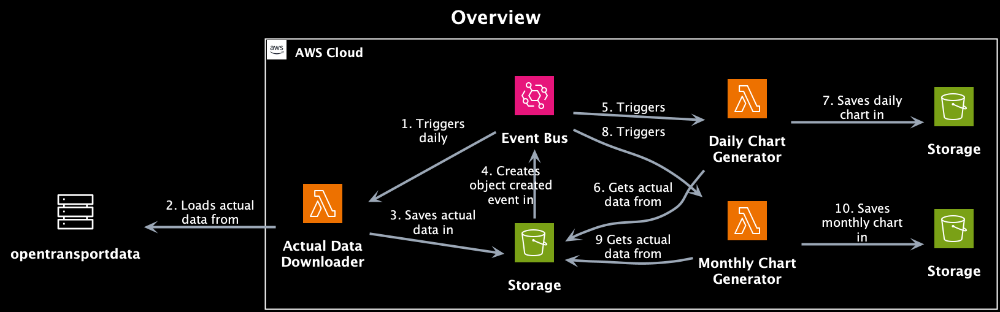

# STI Bus Delays



## Application

### Actual Data Downloader

AWS Lambda application (daily triggered) that downloads a csv file with actual data from
opentransportdata and saves it in an S3 bucket.

- [Source Code](application/actual-data-downloader/actual_data_downloader/index.py)
- [Integration Test](application/actual-data-downloader/tests/integration/test_index.py)

### Daily Chart Generator

AWS Lambda application (triggered by an object created event) that processes a daily csv file and generates a daily
chart as png and saves it in an S3 bucket.

- [Source Code](application/daily-chart-generator/daily_chart_generator/index.py)
- [Integration Test](application/daily-chart-generator/tests/integration/test_index.py)

### Monthly Chart Generator

AWS Lambda application (triggered by an object created event) that processes all csv files of the month and
generates a monthly
chart as png and saves it in an S3 bucket.

- [Source Code](application/monthly-chart-generator/monthly_chart_generator/index.py)
- [Integration Test](application/monthly-chart-generator/tests/integration/test_index.py)

## Infrastructure

The infrastructure is defined and provisioned (including the applications)  using the AWS Cloud Development Kit (CDK)

- [Source Code](infrastructure/lib/sti-bus-delays-stack.ts)

## Deployment

Prerequisites:

- AWS CLI, Typescript & AWS CDK CLI
- Docker

Deploy stack to your default AWS account/region:

```shell
cd infrastructure
cdk deploy
```

### Infrastructure Development

Install dependencies:

```shell
cd infrastructure
npm install
```

Run tests:

```shell
cd infrastructure
npm run build
npm run test
```

## Application Development

Prerequisites:

- Homebrew (package manager for macOS)

Install pipx:

```shell
brew install pipx
pipx ensurepath
```

Install poetry:

```shell
pipx install poetry==1.8.3
```

Install dependencies (for each application):

```shell
cd application/actual-data-downloader
poetry install
```

### Run tests

Run minio (local object storage):

```shell
docker compose up -d
```

Run all tests (for each application):

```shell
cd application/actual-data-downloader
poetry run pytest 
```

Run unit tests (for each application):

```shell
cd application/actual-data-downloader
poetry run pytest tests/unit
```

Run integration tests (for each application):

```shell
cd application/actual-data-downloader
poetry run pytest tests/integration
```

Access to minio:

- URL: <http://localhost:9001/>
- Username: minio
- Password: minio123
